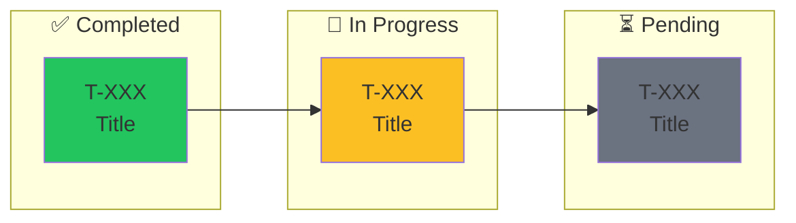

# C4 Project Status

Show the current C4 project status with visual task graph progress.

## Instructions

### Step 1: Get Basic Status
Call `mcp__c4__c4_status` to get the current project status.

### Step 2: Get Task Details
Query the SQLite database to get all tasks with dependencies:
```bash
sqlite3 -json /path/to/.c4/c4.db "SELECT task_id, status, task_json FROM c4_tasks WHERE project_id='c4' ORDER BY task_id"
```

### Step 3: Display Status

#### 3.1 Basic Info
```
## C4 Status: [PROJECT_ID]
============================
**State:** [STATE] ([execution_mode])
```

#### 3.2 Overall Progress Bar
Calculate completion percentage and display:
```
### Overall Progress
████████████████░░░░░░░░░░░░░░░░░░░░░  XX% (done/total tasks)
```

Use filled blocks (█) for done, empty (░) for remaining. Bar width = 37 chars.

#### 3.3 Phase Progress
Group tasks by phase (based on task ID ranges or prefix patterns):
- Parse task titles/IDs to identify phases
- Show each phase with its own progress bar
- Use tree structure to show task hierarchy and dependencies

Format:
```
Phase N: [Name]           ████████████████████ 100% (X/Y)  ✅ Complete
├─ T-XXX [✅] Task title
├─ T-XXX [🔄] Task title (in progress)
├─ T-XXX [⏸] Task title ←── dependencies
└─ T-XXX [⏸] Task title
```

Status icons:
- ✅ = done
- 🔄 = in_progress
- ⏸ = pending

#### 3.4 Dependency Graph (Mermaid)
Generate a Mermaid flowchart showing:
- Task dependencies as arrows
- Color coding: green (#22c55e) for done, yellow (#fbbf24) for in_progress, gray (#6b7280) for pending
- Group related tasks in subgraphs



#### 3.5 Queue Summary Table
```
### Queue
| Status | Count | Details |
|--------|-------|---------|
| Pending | X | T-XXX, T-XXX... |
| In Progress | X | T-XXX → worker-id |
| Done | X | ✓ |
```

#### 3.6 Workers Table
```
### Workers (N registered)
| Worker | State | Task |
|--------|-------|------|
| worker-id | **busy** | T-XXX |
| worker-id | idle | - |
```

#### 3.7 Next Ready Tasks
List tasks that have no pending dependencies (can start immediately):
```
### Next Ready Tasks (no blockers)
- **T-XXX**: Task title - 바로 시작 가능
```

#### 3.8 Supervisor & Metrics
```
### Supervisor
- Loop: running/not running
- Mode: ai_review
- Checkpoint queue: N
- Repair queue: N

### Metrics
- Tasks completed: **N**
- Events emitted: N
- Validations run: N
- Checkpoints passed: N
```

## Usage

```
/c4-status
```

## Example Output

```
## C4 Status: my-project
============================
**State:** EXECUTE (running)

### Overall Progress
████████████████████░░░░░░░░░░░░░░░░░  57% (21/37 tasks)

### Progress by Phase

Phase 1: Setup            ████████████████████ 100% (5/5)  ✅ Complete
├─ T-001 [✅] Initialize project
├─ T-002 [✅] Setup database
├─ T-003 [✅] Configure auth
├─ T-004 [✅] Add logging
└─ T-005 [✅] Write tests

Phase 2: Core Features    ██████████░░░░░░░░░░  50% (2/4)  🔄 In Progress
├─ T-010 [✅] User model
├─ T-011 [✅] API endpoints
├─ T-012 [🔄] Frontend ←── T-011
└─ T-013 [⏸] Integration ←── T-012

Phase 3: Polish           ░░░░░░░░░░░░░░░░░░░░   0% (0/3)  ⏳ Pending
├─ T-020 [⏸] Performance ←── T-013
├─ T-021 [⏸] Documentation ←── T-020
└─ T-022 [⏸] Release ←── T-021

### Dependency Graph
[Mermaid diagram here]

### Queue
| Status | Count | Details |
|--------|-------|---------|
| Pending | 4 | T-013, T-020, T-021, T-022 |
| In Progress | 1 | T-012 → worker-abc123 |
| Done | 7 | ✓ |

### Workers (2 registered)
| Worker | State | Task |
|--------|-------|------|
| worker-abc123 | **busy** | T-012 |
| worker-main | idle | - |

### Next Ready Tasks (no blockers)
- No tasks ready - all pending tasks have dependencies

### Supervisor
- Loop: **running**
- Mode: ai_review

### Metrics
- Tasks completed: **7**
- Events emitted: 25
```

## Notes

- Phase grouping is inferred from task ID patterns (e.g., T-0XX, T-1XX) or title prefixes
- Dependencies are parsed from `task_json.dependencies` array
- Progress bars use 20 character width for phase bars
- Always show the critical path through the dependency graph
