<div align="center">

[한국어](README.ko.md)

# CQ — GPU Anywhere, Anytime, Anything.

**Your GPUs are idle 70% of the time. CQ connects them to AI — zero config, any OS, encrypted.**




</div>

---

## Why CQ?

| | Without CQ | With CQ |
|---|---|---|
| Your GPU at 2am | Idle, wasting electricity | Running your experiment |
| Cross-device AI | Loses context every session | Persistent memory everywhere |
| Code quality | Hope and pray | 6-axis automated review |

---

## Use Cases

### 🖥️ Run AI Experiments on Your Home GPU — From Anywhere

Start a training job from your laptop, phone, or any AI assistant. CQ's Hub dispatches tasks to whichever GPU is available, streams metrics back in real time, and stores artifacts automatically.

```sh
cq job submit --image pytorch --gpu 1 -- python train.py
```

### 🧠 External Brain That Follows You Across AI Platforms

Every conversation contributes to your knowledge base. ChatGPT finds a bug root cause — Claude picks it up in the next session. Decisions, patterns, and discoveries persist across tools, sessions, and devices.

```sh
cq serve   # Start the MCP bridge. That's it.
```

### 🔒 Encrypted P2P — No Port Forwarding, No VPN

CQ uses a relay server for NAT traversal. Traffic between your machines is end-to-end encrypted. Works behind corporate firewalls, WSL2, and dynamic IPs with zero configuration.

---

## Quick Start

```sh
curl -fsSL https://raw.githubusercontent.com/PlayIdea-Lab/cq/main/install.sh | sh
cq init          # Login + project setup (one-time)
cq claude        # Start building
```

Update anytime: `cq update`

---

## Works With

| AI Tool | Integration |
|---|---|
| **Claude Code** | Native MCP — full tool access |
| **ChatGPT** | OAuth 2.1 remote MCP proxy |
| **Cursor** | Remote MCP via `mcp.pilab.kr` |
| **Gemini CLI** | MCP-compatible connection |

---

## Pricing

| | Free | Pro | Team |
|---|---|---|---|
| **Price** | $0 | $5–10/mo | Contact us |
| **Mode** | solo | connected | full |
| **Knowledge (AI self-capture)** | Local SQLite | Cloud (pgvector) | Cloud + shared |
| **Hub GPU jobs** | — | 100 calls/mo | Unlimited |
| **Relay (P2P)** | — | Included | Included |
| **Research Loop** | — | Included | Included |
| **Team knowledge base** | — | — | Included |

---

## Key Components

| Component | Description |
|-----------|-------------|
| **Go MCP Server** | 275+ tools (core + Hub + conditional), Registry-based |
| **Knowledge** | FTS5 + pgvector (OpenAI 1536d) + 3-way RRF + auto-distill |
| **Hub** | Distributed job queue, DAG engine, artifact store, cron, watchdog |
| **Session** | Auto-summarize via LLM, context injection on startup |
| **Research Loop** | Autonomous ML experiment cycle (plan→train→evaluate→iterate) |
| **Paper Mode** | Structured paper/document learning with knowledge DB integration |
| **42 Skills** | Claude Code slash commands (/plan, /run, /finish, /pi, /paper, etc.) |

---

<details>
<summary>Architecture</summary>

```
┌──────────────────┐          ┌────────────────────────────┐
│ Local (Thin Agent)│  JWT    │ Cloud (Supabase)            │
│                   │◄───────►│                             │
│ Hands:            │         │ Brain:                      │
│  ├ Files / Git    │         │  ├ Tasks (Postgres)         │
│  ├ Build / Test   │         │  ├ Knowledge (pgvector)     │
│  ├ LSP analysis   │         │  ├ LLM Proxy (Edge Fn)     │
│  └ MCP bridge     │         │  ├ Quality Gates            │
│                   │         │  └ Hub (distributed jobs)   │
│ Service (cq serve)│   WSS   │                             │
│  ├ Relay ─────────┼────────►│  Relay (Fly.io)             │
│  ├ EventBus       │         │  └ NAT traversal            │
│  └ Token refresh  │         │                             │
└──────────────────┘          │ External Brain (CF Worker)  │
                              │  ├ OAuth 2.1 MCP proxy      │
Any AI (ChatGPT,   ── MCP ──►│  ├ Knowledge record/search  │
 Claude, Gemini)              │  └ Session summary          │
                              └────────────────────────────┘

solo:       Everything local (SQLite + your API key)
connected:  Brain in cloud + relay (login + serve)
full:       Connected + GPU workers + research loop
```

</details>

---

## Development

```bash
cd c4-core && make install                             # Build + install
cd c4-core && go build ./... && go test -p 1 ./...    # Go tests
uv run pytest tests/                                   # Python tests
cq doctor                                              # Health check
```

[Documentation](https://playidea-lab.github.io/cq) | [Installation](https://playidea-lab.github.io/cq/guide/install) | [Quick Start](https://playidea-lab.github.io/cq/guide/quickstart) | [Architecture](https://playidea-lab.github.io/cq/reference/architecture)

---

## License

Personal Study & Research License (Non-Commercial). See [LICENSE.md](./LICENSE.md). Copyright (c) 2026 PlayIdeaLab.
