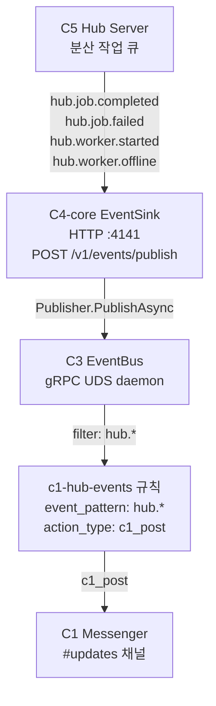

# C4 배포 토폴로지 — 클라우드 vs 로컬

> C4는 **Local-First + Required Auth** 설계.
> 모든 사용자는 SSO 로그인 필수 (무료 포함), 클라우드 키는 바이너리에 내장.

---

## 1. 운영자가 상시 배포/운영하는 것 (Cloud Infra)

### 1-1. Supabase 프로젝트

| 항목 | 내용 |
|------|------|
| **PostgreSQL** | 21개 마이그레이션, 멀티테넌트 RLS |
| **Auth** | GitHub OAuth (SSO 로그인) |
| **Storage** | `c4-drive` 버킷 (파일 아티팩트) |
| **Realtime** | C1 Channels/Messages 실시간 구독 |

**테이블** (사용자가 관리할 필요 없음):
```
c4_projects, c4_project_members     — 프로젝트/팀
c4_tasks, c4_state                  — 태스크/상태 (클라우드 백업)
c4_checkpoints                      — 리뷰 결정
c4_personas, c4_growth, c4_traces   — Soul/Twin
c4_lighthouses                      — Contract-First 스펙
c4_documents                        — 파싱된 문서 메타
c4_drive                            — Drive 파일 매니페스트
c1_channels, c1_messages            — C1 메시징
c1_participants, c1_channel_summaries — C1 참여자/요약
```

**운영 할 일**: Supabase 프로젝트 생성, 마이그레이션 적용, OAuth 앱 등록, 모니터링

### 1-2. PiQ Hub (원격 GPU 스케줄러)

| 항목 | 내용 |
|------|------|
| **API 서버** | Job Queue, Worker Pool, DAG 실행 |
| **Artifact Storage** | Presigned URL 업로드/다운로드 |

**운영 할 일**: Hub 서버 운영, Worker 노드 관리, GPU 할당

### 1-3. install.sh 호스팅

| 항목 | 내용 |
|------|------|
| **URL** | `https://raw.githubusercontent.com/PlayIdea-Lab/cq/main/install.sh` |
| **용도** | `curl \| bash` 원라인 설치 |

**운영 할 일**: Git 서버에서 main 브랜치의 install.sh 접근 가능하게 유지

---

## 2. 사용자 로컬에 내려가는 것

### 2-1. Go MCP 바이너리 (핵심)

```
~/.local/bin/cq  또는  c4-core/bin/cq
```
- 118개 MCP 도구의 실행 엔진
- Claude Code가 stdio로 직접 실행
- **Supabase URL/AnonKey가 바이너리에 내장** (ldflags)
- 오프라인에서도 로컬 기능 100% 동작

### 2-2. Python Sidecar

```
c4/ (uv sync로 의존성 설치)
```
- LSP 7개 + C2 Doc 2개 + Onboard 1개 = 10 tools
- Go 바이너리가 JSON-RPC/TCP로 lazy 기동
- Python 미설치 시 graceful fallback (102개 Go 도구는 정상)

### 2-3. 로컬 데이터 (SQLite)

| 파일 | 용도 | 클라우드 동기화 |
|------|------|----------------|
| `.c4/c4.db` | 태스크, 상태, 체크포인트, 아티팩트 | 로그인 시 async |
| `.c4/eventbus.db` | 이벤트 로그, DLQ | 로컬 전용 |
| `.c4/knowledge/` | 지식 문서 + 벡터 임베딩 | 로그인 시 async |
| `.c4/research/` | 연구 반복 이력 | 로컬 전용 |
| `~/.c4/session.json` | OAuth 세션 토큰 | 로컬 전용 |

### 2-4. Daemon Scheduler (로컬 GPU)

```
127.0.0.1:9090 (자동 기동)
```
- Hub 미연결 시 자동으로 로컬 대체
- Hub와 동일한 REST 인터페이스 (`hub.Client(apiPrefix="")`)

### 2-5. EventBus Daemon

```
~/.c4/eventbus.sock (UDS)
127.0.0.1:{ws_port} (WebSocket bridge)
```
- MCP 서버에 embedded auto-start
- gRPC + WebSocket, 로컬 전용

### 2-6. C1 Desktop (선택)

```
Tauri 2.x 앱
```
- 6개 뷰 (Sessions/Dashboard/Config/Documents/Channels/Events)
- 로컬 프로젝트 탐색 + 클라우드 채널 구독
- 클라우드 없이 로컬 뷰(Sessions/Dashboard/Config)만으로 동작

---

## 3. 인증 흐름 — 사용자는 키를 모른다

### 설치 후 로그인 (모든 사용자 필수)

```bash
# 1. 설치
curl -sSL https://raw.githubusercontent.com/PlayIdea-Lab/cq/main/install.sh | bash

# 2. 로그인 (SSO)
cq auth login
# → 브라우저가 열림 → GitHub OAuth → 토큰 자동 저장

# 3. 확인
cq auth status
# → User: changmin (changmin@pilab.co.kr)
# → Status: authenticated (expires in 23h 45m)
```

### 크리덴셜 해결 우선순위

```
1. 환경변수: C4_CLOUD_URL / C4_CLOUD_ANON_KEY      (개발자 오버라이드)
2. 환경변수: SUPABASE_URL / SUPABASE_KEY            (레거시 호환)
3. 빌트인 기본값: ldflags로 바이너리에 주입           (서비스 배포)
```

**사용자가 설정할 것**: 없음. `cq auth login`만 하면 됨.
**개발자가 오버라이드**: `.env`에 `SUPABASE_URL`/`SUPABASE_KEY` 설정 가능.

### .env 파일 — 선택적 (고급 사용자/개발자만)

```bash
# LLM Gateway (자체 API 키가 필요한 경우만)
ANTHROPIC_API_KEY=sk-ant-...
OPENAI_API_KEY=sk-...

# Hub 연결 (원격 GPU 사용 시)
C5_HUB_URL=https://hub.pilab.co.kr
C5_API_KEY=...
```

---

## 4. 경계 다이어그램

```
┌─────────────────────────────────────────────────┐
│            운영자 상시 운영 (Cloud)                │
│                                                  │
│  ┌─ Supabase ──────────────────────────────┐    │
│  │  PostgreSQL (14 tables, RLS)            │    │
│  │  Auth (GitHub OAuth SSO)                │    │
│  │  Storage (c4-drive)                     │    │
│  │  Realtime (C1 channels)                 │    │
│  └─────────────────────────────────────────┘    │
│                                                  │
│  ┌─ PiQ Hub ───────────────────────────────┐    │
│  │  Job Queue + Worker + DAG               │    │
│  │  Artifact Store                         │    │
│  │  Edge Deploy                            │    │
│  └─────────────────────────────────────────┘    │
│                                                  │
│  ┌─ Git 서버 ──────────────────────────────┐    │
│  │  install.sh 호스팅                       │    │
│  │  소스 코드 배포                          │    │
│  └─────────────────────────────────────────┘    │
└─────────────────────────────────────────────────┘
                    ↕ (cq auth login 후 자동 연결)
┌─────────────────────────────────────────────────┐
│            사용자 로컬                            │
│                                                  │
│  ┌─ C4 Engine ─────────────────────────────┐    │
│  │  Go MCP Binary (118 tools)              │    │
│  │    └─ Supabase URL/Key 내장 (ldflags)   │    │
│  │  Python Sidecar (10 tools, lazy)        │    │
│  │  SQLite stores (tasks/knowledge/        │    │
│  │    events/research)                     │    │
│  │  Daemon Scheduler (로컬 GPU fallback)   │    │
│  │  EventBus (gRPC + WS, embedded)         │    │
│  └─────────────────────────────────────────┘    │
│                                                  │
│  ┌─ C1 Desktop (선택) ────────────────────┐     │
│  │  Tauri 앱 (6개 뷰)                     │     │
│  └─────────────────────────────────────────┘    │
│                                                  │
│  ┌─ 사용자 제공 ───────────────────────────┐    │
│  │  Go 1.22+, Python 3.11+, uv            │    │
│  │  .env (LLM API 키, Hub 키 — 선택)      │    │
│  └─────────────────────────────────────────┘    │
└─────────────────────────────────────────────────┘
```

---

## 5. 사용자 시나리오별 필요 인프라

| 시나리오 | 로그인 필수? | 클라우드 사용? | 사용자 설정 |
|----------|:---:|:---:|------|
| **Solo 개발 (오프라인)** | 첫 설치 시만 | 태스크 백업만 | `install.sh` + `cq auth login` |
| **Solo + 지식 동기화** | O | Knowledge sync | 위와 동일 |
| **팀 협업 (C1 채널)** | O | Realtime | 위와 동일 |
| **파일 공유 (Drive)** | O | Storage | 위와 동일 |
| **원격 GPU 학습** | O | Hub | `.env`에 `C4_HUB_URL` 추가 |
| **LLM Gateway** | O | 외부 API | `.env`에 LLM API 키 추가 |

**핵심**: 기본 사용은 `install.sh` + `cq auth login`이면 끝. 추가 설정은 Hub/LLM 사용 시에만.

---

## 6. 운영 비용 구조

| 인프라 | 비용 | 비고 |
|--------|------|------|
| **Supabase Free** | $0/월 | 500MB DB, 1GB Storage, 50K MAU |
| **Supabase Pro** | $25/월 | 8GB DB, 100GB Storage, 무제한 MAU |
| **PiQ Hub** | GPU 비용 | 자체 운영 또는 클라우드 GPU |
| **Git 서버** | 기존 인프라 | pilab.co.kr |

**핵심**: 사용자 0명이어도 Supabase Free tier로 유지 가능. 스케일링은 Supabase가 처리.

---

## 7. 빌드 시 서비스 크리덴셜 주입

운영 배포 시 `install.sh` 또는 직접 빌드에서 ldflags로 Supabase 크리덴셜을 주입:

```bash
# install.sh를 통한 빌드 (권장)
C4_SUPABASE_URL="https://xxx.supabase.co" \
C4_SUPABASE_KEY="eyJ..." \
./install.sh

# 직접 빌드
cd c4-core && go build \
  -ldflags "-X main.version=v1.0.0 \
            -X main.builtinSupabaseURL=https://xxx.supabase.co \
            -X main.builtinSupabaseKey=eyJ..." \
  -o ~/.local/bin/cq ./cmd/c4/
```

**anon key 보안**: Supabase anon key는 공개 값 (RLS가 데이터 보호). 바이너리에 내장해도 안전.

---

## 8. 전달물 요약

| 파일 | 전달 방식 | 사용자가 할 일 |
|------|-----------|---------------|
| Go 바이너리 | `install.sh` 자동 빌드 | 없음 |
| Python 의존성 | `uv sync` 자동 | 없음 |
| `.mcp.json` | `install.sh` 자동 생성 | 없음 |
| `.c4/config.yaml` | `c4-init` 시 생성 | 없음 |
| `CLAUDE.md` | 소스에 포함 | 없음 |
| `SOUL.md` | 소스에 포함 | 커스텀 가능 |
| `.env` | **사용자 직접 (선택)** | Hub/LLM 키만 |
| Supabase URL/Key | **바이너리 내장** | 없음 |
| OAuth 세션 | `cq auth login` | GitHub 인증만 |

---

## 9. C5 Hub → C4 EventSink 이벤트 흐름

C5 Hub 서버가 job/worker 상태 변화를 C4 EventBus로 전달하는 E2E 이벤트 파이프라인.

### 흐름 다이어그램 (Mermaid)



### ASCII 흐름

```
C5 Hub Server
  └─(POST /v1/events/publish)──→ C4-core EventSink(:4141)
       └─(Publisher.PublishAsync)──→ C3 EventBus (gRPC UDS)
            └─(c1-hub-events rule, hub.* filter)──→ C1 Messenger (#updates)
```

### 이벤트 종류

| 이벤트 | 트리거 | 페이로드 |
|--------|--------|---------|
| `hub.job.completed` | Job 완료 시 | `job_id`, `name`, `status` |
| `hub.job.failed` | Job 실패 시 | `job_id`, `name`, `error` |
| `hub.worker.started` | Worker 기동 시 | `worker_id`, `tags` |
| `hub.worker.offline` | Worker 종료 시 | `worker_id`, `reason` |

### C5 환경변수

C5 서버에서 C4 EventSink로 이벤트를 발행하기 위해 아래 환경변수를 설정한다:

```bash
# C5 → C4 EventSink 연결 설정
C5_EVENTBUS_URL=http://localhost:4141    # C4 EventSink 주소
C5_EVENTBUS_TOKEN=                       # Bearer 인증 토큰 (기본: 없음)
```

- `C5_EVENTBUS_URL` 미설정 시 이벤트 발행 비활성화 (graceful fallback).
- `C5_EVENTBUS_TOKEN` 설정 시 `Authorization: Bearer <token>` 헤더 전송.
